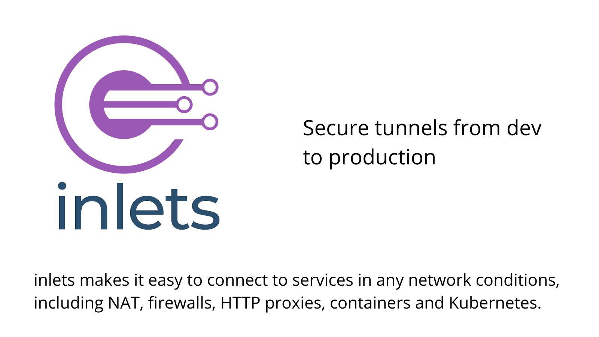

## Inlets reinvents the concept of a tunnel for a Cloud Native world.

With inlets you are in control of your data, unlike with a SaaS tunnel where shared servers mean your data may be at risk. You can use inlets for local development and in your production environment. It works just as well on bare-metal as in VMs, containers and Kubernetes clusters.



> inlets is not just compatible with tricky networks and Cloud Native architecture, it was purpose-built for them.

Common use-cases include:

* Exposing your local endpoints on the Internet
* Self-hosting Kubernetes or K3s clusters
* Deploying and monitoring apps across multiple locations
* Supporting your customers remotely
* Hybrid cloud for legacy TCP applications

## What's it look like?

Every inlets tunnel has two parts: its server and its client, but they're one binary and can run entirely within userspace. This makes it very easy to customise and distribute for different use-cases.

* It's a single binary for MacOS, Windows and Linux
* Works on bare-metal, in VMs, in containers and on Kubernetes
* Set it up manually, with Helm, or with a Kubernetes Operator


> inlets *just works*, why not test it and see?

The tunnel client usually runs in a private network, and the server may run on a network with a public IP. When the two are connected, it's like the private server is actually on the Internet.

### How's it different to other solutions?

Inlets is not a VPN, it's for exposing local services on another network or on the Internet. You can [read more in our FAQ](https://docs.inlets.dev/reference/faq/)

* Host your tunnel server wherever you want for low latency
* Use it in development and production environments
* Expose as many HTTPS websites as you like
* Expose whatever TCP ports you need
* Get more done, without running into rate-limits imposed by a service provider
* Use your own DNS instead of paying per domain.

## Getting started

> A valid license key or Gumroad subscription is required to launch or deploy inlets. By using the software you agree that you have purchased a license and are bound by the terms of the [End User License Agreement (EULA)](/EULA.md)

Find out more:

* [Read the documentation](https://docs.inlets.dev/)
* [Understand use-cases on the blog](https://inlets.dev/blog/)
* [Contact us](https://inlets.dev/contact/)

### For cloud natives

* [Kubernetes Ingress with the inlets-operator](https://docs.inlets.dev/tutorial/kubernetes-ingress/)
* [Expose Ingress with the helm chart](https://inlets.dev/blog/2021/07/08/short-lived-clusters.html)
* [Reliable local port-forwarding from Kubernetes](https://inlets.dev/blog/2021/04/13/local-port-forwarding-kubernetes.html)
* [How to connect your on-premises databases to Kubernetes in the cloud](https://inlets.dev/blog/2020/11/06/hybrid-cloud-with-inlets.html)
* [How to monitor multi-cloud Kubernetes with Prometheus and Grafana](https://inlets.dev/blog/2020/12/15/multi-cluster-monitoring.html)

### For modernizing apps and exposing private services

* [Tutorial: Expose one or more local HTTP services via HTTPS](https://inlets.dev/blog/2021/08/08/private-tunnel.html)
* [When you can't get a static IP from your ISP](https://inlets.dev/blog/2021/04/13/your-isp-wont-give-you-a-static-ip.html)
* [The Simple Way To Connect Existing Apps to Public Cloud](https://inlets.dev/blog/2021/04/07/simple-hybrid-cloud.html)
* [Tutorial: Tunnel a private Postgresql database](https://docs.inlets.dev/tutorial/postgresql-tcp-tunnel/)

### Getting inlets

You'll need a [subscription for inlets](https://openfaas.gumroad.com/l/inlets-subscription), but can pay monthly or save money through an annual subscription.

Both the client and server are contained within the same binary.

It is recommended that you use [inletsctl](https://github.com/inlets/inletsctl), or [inlets-operator](https://github.com/inlets/inlets-operator) to create inlets tunnel servers, but you can also [create these manually](https://docs.inlets.dev/tutorial/manual-http-server/).

The inlets binary can be obtained as a stand-alone executable, or via a container image.

* As a binary:

    ```sh
    curl -SLsf https://github.com/inlets/inlets-pro/releases/download/0.9.23/inlets-pro > inlets-pro
    chmod +x ./inlets-pro
    ```

    Or find a binary for [a different architecture on the releases page](https://github.com/inlets/inlets-pro/releases)

    See also [CLI reference guide](docs/cli-reference.md)

* As a container image

    A container image is published at as `ghcr.io/inlets/inlets-pro`
    
    See the various tags available: [View tags](https://github.com/orgs/inlets/packages/container/package/inlets-pro)

* Kubernetes Helm charts & Operator

    Run ad-hoc clients and servers on your Kubernetes clusters

    See the [helm chart](chart)

    Or try [the Operator](https://github.com/inlets/inlets-operator) if you want an integration for your LoadBalancers on Kubernetes.

## Want to speak to someone?

If you want to contact someone about inlets, please feel free to get in touch via this form:

* [Contact us](https://inlets.dev/contact/)
