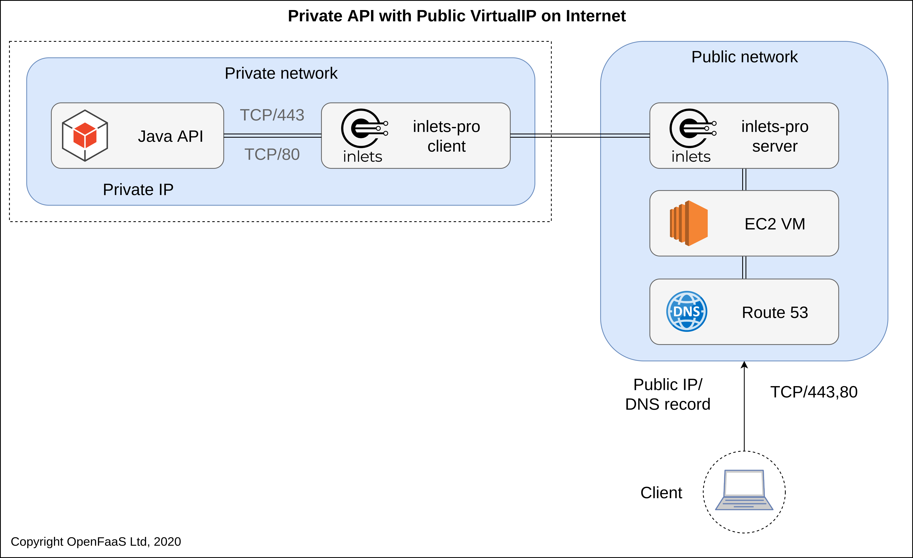
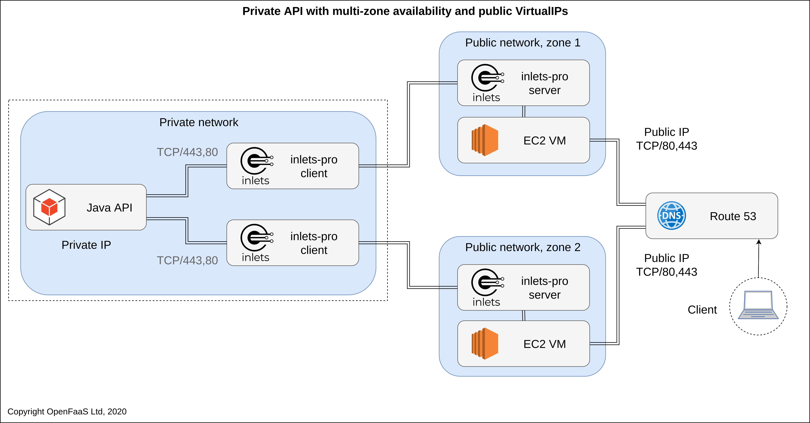
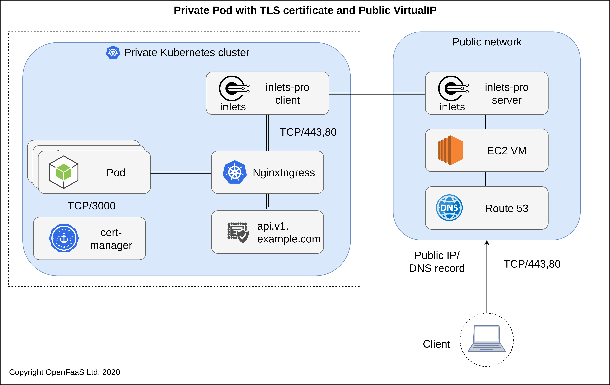
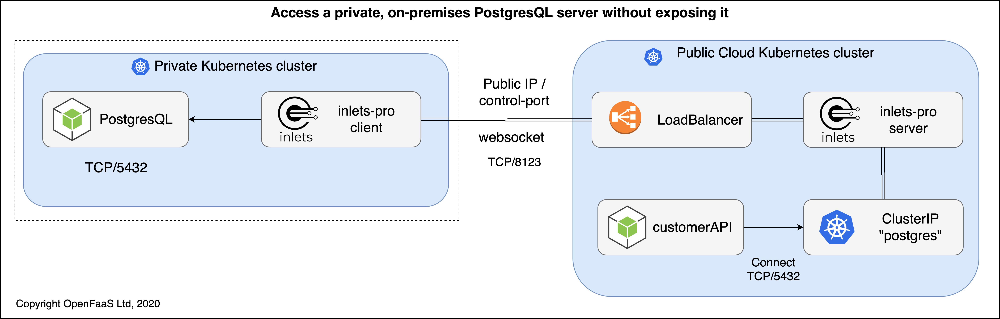

## Reference architecture for inlets Pro

### Single private service with Public VirtualIP

For a single private on-premises Java API service, one exit-server is provisioned on public cloud, its Public IP is the VirtualIP for the private cluster. Ports 80 and 443 are forwarded to the Java API, which can serve its own TLS certificate.

### Single private service with Highly-available, multi-zone Public VirtualIP and DNS

For a single private on-premises Java API service, two exit-servers are provisioned on public cloud, each with a Public VirtualIP. DNS is used to provide high-availability and fail-over. Ports 80 and 443 are forwarded to the Java API, which can serve its own TLS certificate.

### Private Kubernetes Cluster, High-available Pod, public VirtualIP

Example: A private or on-premises Kubernetes cluster serving traffic from a Node.js Pod on port 3000. An IngressController performs TLS termination and stores a certificate within the private cluster. The certificate can be obtained from LetsEncrypt using standard tooling such as [cert-manager](https://cert-manager.io/docs/).

### Remote TCP service running on client site, edge, or on-premises. Command and control from central location

Example: You have a remote TCP service such as a PostgreSQL database which is running in a private network such as a client's site, at an edge location, or on-premises. You need to access that database from a public or central cluster. The PostgreSQL database must not be exposed on the Internet, and a split-plane is used where only the control-plane of inlets-pro is public. From within your destination cluster, services can access the database via a private ClusterIP.

